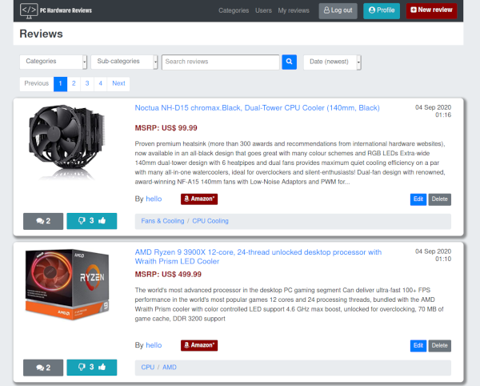
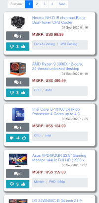

# PC Hardware Reviews

## Data-Centric Development Milestone Project
A demo of this project can be viewed [here](https://tgc07-project03.herokuapp.com/).
The sample user log in details below can be used to demo the project:
| Email | Password | Access Rights |
|-------|----------|---------------|
| admin@email.com | password123 | administrator |
| limited@email.com | password123 | limited |

This website has been designed for PC hardware enthusiasts to post their reviews on PC components. The general public are able read the reviews for free, without any requirement to login. However, to post a review, comment, or vote, registation for a user account and login are required.

The site owner is assumed to be part of the Amazon affiliate programme, enabling the website to earn affiliate referral income from any click-throughs to product purchases. 

### Disclaimer
Most, if not all, of the external links in this project direct towards actual Amazon products, however **the affiliate referral modifiers are not genuine**.

## UX

### Strategy - User Stories
Members of the public would use the website to:
- Browse reviews of PC components to make more informed decisions when buying PC products.
- Read comments made on reviews to understand other people's views and opinions.
- Post reviews to be help the PC enthusiast community.
- Post comments to share personal experiences and opinions on PC products.
- Help the PC entusiast community members with any troubleshooting problems they may have encountered.
- Easily make purchases of products via the linked product pages.
- Vote up or down if they like or dislike a review.

Owners of the website would like to:
- Earn referral income on purchases that arise from click-throughs of the site's affiliate links.
- Be able to moderate the site content via admin accounts that can edit and delete reviews and comments, to maintain a friendly and welcoming environment for all users.
- Also be users of the site, by posting and reading reviews/comments related to PC components.




### Scope
Content requirements:
- images of PC components being reviewed
- text for review content
- URLs to Amazon product pages
- icons for vote feature

Functional specification:
- vote buttons need to be able to function without requiring page to reload
- pages to separate reviews into manageable sizes so that each web page does not get too long

### Structure
The website structure will be presented using the hierarchical model. Main sections will be:
- review threads - summary page of all reviews at the top, accessible by anyone, leading to multiple individual reviews
- categories - summary of all categories and sub-categories, only accessible by admin users, with create, update, delete links accessible from here
- users - summary table of all users, only accessible by admin users, with create, update, delete links accessible from here

### Skeleton
Wireframes for the reviews summary page and individual reviews can be viewed [here](report/wireframes). A HTML table will be used to display all the users in the admin panel.

### Surface
Functionality and clarity was the main focus and reason behind the colour scheme and typography choice, as it was assumed that PC hardware enthusiasts would place preference on these aspects. If there had been more time, the colour scheme and styling should be revisited.

## Features

### Current Features
#### PC Component Reviews
- Ability to read all reviews, without needing to sign up for user account.
- Create, update, delete reviews that were written by yourself.
- Sort reviews by chronological order, reverse chronological order, price (low to high), price (high to low).
- Search reviews by category, sub-category and search box to query review title, review description or comments.
- Vote up or down on reviews if user has an account and is logged in, without need to reload page.
- Clicking a vote button will check if user has previously voted. If user had previously voted on same button currently clicked, then this latest action will remove the vote. If user had previously voted on the opposite vote button, then the opposite vote previously cast will be removed and the new vote cast.
- Update and delete any reviews if user has admin rights.
- Create and update review thread forms include validation steps that must be passed before being able to proceed. If there are errors, all input fields will be pre-populated with previously entered data on page reload.

#### Review Comments
- Ability to read all comments, without needing to sign up for user account.
- Create, update, delete comments that were written by yourself.

#### User accounts
- Sign up for user account, log in, log out.
- Update and delete user account details for user's own account.
- Update and delete any user account details if user has admin rights.
- Add or remove admin rights to users if current logged in user has admin rights.
- User log in and sign up forms include validation steps that must be passed before being able to proceed. If there are errors all fields except for password will be pre-populated on page reload.
- Create, update, delete categories and sub-categories if user has admin rights.

### Features Left to Implement:
- Ability to apply simple formatting of the review and comments text by using a library such as [Summernote](https://summernote.org/).
- Add search and pagination to page displaying reviews by specified user.
- Separate user profile update fields, so that each field can be updated individually.
- Quote other comments previously posted.
- Sort by most up-voted or down-voted reviews.
- Stop word filtering to automatically remove pre-determined list of bad words from reviews and comments before they get posted.
- Check if username and email are unique before allowing user to create or update to them.
- Check if categories and sub-categories are unique before allowing admin user to create or update to them.

## Technologies Used
- Python
- HTML
- CSS
- JavaScript
- [MongoDB Atlas](https://www.mongodb.com/cloud/atlas) for cloud hosted database
- [Flask 1.1.2](https://flask.palletsprojects.com/en/1.1.x/) to create the web app
- [Flask-Login 0.5.0](https://flask-login.readthedocs.io/en/latest/) for user authentication
- [passlib 1.7.2](https://passlib.readthedocs.io/en/stable/) for password hashing
- [Jinja 2.11.2](https://jinja.palletsprojects.com/en/2.11.x/) for templating
- [pymongo 3.11.0](https://pymongo.readthedocs.io/) to communicate with MongoDB database using Python
- [dotenv](https://pypi.org/project/python-dotenv/) to use environment variables
- [JQuery](https://jquery.com/) for DOM manipulation
- [Axios](https://github.com/axios/axios) for AJAX calls
- [toastr](https://codeseven.github.io/toastr/) for flash messaging
- [Bootstrap 4.5](https://getbootstrap.com/docs/4.5/getting-started/introduction/) for web page styling
- [Font Awesome 4.7.0](https://fontawesome.com/v4.7.0/) for icons
- [Heroku](https://www.heroku.com/) to host the web app
- [gunicorn 20.0.4](https://gunicorn.org/) as the Python WSGI HTTP Server for deployment
- [GitHub](https://github.com/) for source control

## Programming Methodologies
- RESTful API was used to allow casting of votes, counting votes, counting comments and retrieving sub-categories via AJAX calls.
- .env file was used to store environment variables so that Flask secret key and database credentials were not publicly viewable.

## Database Design
The ER diagram for this project's database can be viewed [here](report/erd/erd.png)

Three MongoDB collections were used:
1. Users
2. Categories - sub-categories were embedded in documents of the categories collection
3. Threads (Reviews) - comments were embedded in documents of the threads collection

### Sample MongoDB documents
Sample database document for user:
```
{
	"_id": {
		"$oid": "5f486a62d227fba8090e835b"
	},
	"username": "limited",
	"email": "limited@email.com",
	"gender": "male",
	"password": "$pbkdf2-sha256$29000$zXlvTSlFqBWiFOIcg9AaQw$cLXdZ7DMJ9WbWlgtkNeQC4.BZGXJAx5xIy6QMY34LYE",
	"terms_and_conditions": true,
	"marketing": true,
	"is_admin": false
}
```

Sample database document for category and embedded sub-categories:
```
{
	"_id": {
		"$oid": "5f51950f7b92d484ae6139ec"
	},
	"category": "Fans & Cooling",
	"parent": null,
	"sub_categories": [
		{
			"_id": {
				"$oid": "5f519542be635bcd8f73ab1a"
			},
			"category": "CPU Cooling",
			"parent": {
				"$oid": "5f51950f7b92d484ae6139ec"
			},
			"sub_categories": []
		},
		{
			"_id": {
				"$oid": "5f51954e7b92d484ae6139ed"
			},
			"category": "Case Fans",
			"parent": {
				"$oid": "5f51950f7b92d484ae6139ec"
			},
			"sub_categories": []
		}
	]
}
```

Sample database document for review thread and embedded comments:
```
{
	"_id": {
		"$oid": "5f519581be635bcd8f73ab1b"
	},
	"datetime": {
		"$date": {
			"$numberLong": "1599182209788"
		}
	},
	"user": {
		"user_id": {
			"$oid": "5f4f668d3dc5332b97a71828"
		},
		"username": "hello"
	},
	"category": {
		"category_id": {
			"$oid": "5f51950f7b92d484ae6139ec"
		},
		"category_name": "Fans & Cooling",
		"sub_category_id": {
			"$oid": "5f519542be635bcd8f73ab1a"
		},
		"sub_category_name": "CPU Cooling"
	},
	"product_name": "Noctua NH-D15 chromax.Black, Dual-Tower CPU Cooler (140mm, Black) ",
	"price": {
		"$numberDouble": "99.99"
	},
	"image": "https://m.media-amazon.com/images/I/91t48GBv8TL._AC_UL320_.jpg",
	"affiliate": "https://www.amazon.com/dp/B07Y87YHRH/ref=unique-affiliate-reference-code",
	"description": " Proven premium heatsink (more than 300 awards and recommendations from international hardware websites), now available in an all-black design that goes great with many colour schemes and RGB LEDs\r\nExtra-wide 140mm dual-tower design with 6 heatpipes and dual fans provides maximum quiet cooling efficiency on a par with many all-in-one watercoolers, ideal for overclockers and silent-enthusiasts!\r\nDual-fan design with renowned, award-winning NF-A15 140mm fans with Low-Noise Adaptors and PWM for automatic speed control: Full cooling performance under load, whisper quiet at idle!\r\nIncludes high-end NT-H1 thermal paste and SecuFirm2 mounting system for easy installation on Intel LGA1150, LGA1151, LGA1155, LGA1156, LGA2011, LGA2066 and AMD AM4, AM3(+), AM2(+), FM1, FM2(+)\r\nRenowned Noctua quality backed up by 6-year manufacturer’s warranty, deluxe choice for Intel Core i9, i7, i5, i3 (e.g. 10900K, 10700K, 10600K, 10980XE) and AMD Ryzen (e.g. 3950X, 3900X, 3700X, 3600X) ",
	"votes": {
		"up_votes": [
			{
				"$oid": "5f4f668d3dc5332b97a71828"
			},
			{
				"$oid": "5f4e5633fb67782d23775389"
			}
		],
		"down_votes": []
	},
	"sub_posts": [
		{
			"_id": {
				"$oid": "5f5195fe7b92d484ae6139ee"
			},
			"parent": {
				"$oid": "5f519581be635bcd8f73ab1b"
			},
			"datetime": {
				"$date": {
					"$numberLong": "1599182334225"
				}
			},
			"user": {
				"user_id": {
					"$oid": "5f4f668d3dc5332b97a71828"
				},
				"username": "hello"
			},
			"comment": "I'm using this CPU cooler on my Ryzen 3900X. Cool and quiet.",
			"quote": null
		},
		{
			"_id": {
				"$oid": "5f51d79f797fe16111bafda8"
			},
			"parent": {
				"$oid": "5f519581be635bcd8f73ab1b"
			},
			"datetime": {
				"$date": {
					"$numberLong": "1599199135872"
				}
			},
			"user": {
				"user_id": {
					"$oid": "5f4e5633fb67782d23775389"
				},
				"username": "admin"
			},
			"comment": "Such a good cooler. Really like the blackout colour.",
			"quote": null
		}
	]
}
```

Relationships between the review threads and categories and optional sub-categories were implemented using a hybrid approach, whereby _id and respective names were stored as nested objects within the review thread's document.

Relationships between the review threads and users were implemented using a hybrid approach, whereby _id and respective usernames were stored as nested objects within the review thread's document.

Comments were embedded as array elements within the review thread documents, with the respective user's _id and username also captured here.

Up-votes and down-votes were stored as separate arrays embedded within each review thread document. When a user votes, their user _id is stored as an element within the relevant up-vote or down-vote array. Before the user _id is stored, a check is performed to see if the user had previously voted. If user had previously voted on same button currently clicked, then this latest action will remove the vote. If user had previously voted on the opposite vote button, then the opposite vote previously cast will be removed and the new vote cast.

## Testing
All testing was done manually, with the following tests performed:
|  # | Event | Expected Outcome | Actual Outcome |
|----|-------|------------------|----------------|
| As logged out user on summary page for [all reviews](https://tgc07-project03.herokuapp.com/threads) |
|  1 | Load landing page for all reviews | Maximum of 10 review results should be displayed in reverse chronological order (most recent first) and pagination shown if there are more than 10 reviews in total | As expected |
|  2 | Select category | Sub-categories of selected category should be populated in sub-categories select menu | As expected |
|  3 | Search by category | Only results matching category should show. Search criteria should also be retained in the input form. | As expected |
|  4 | Search by category and sub-category | Only results matching category and sub-category should show. Search criteria should also be retained in the input form. | As expected |
|  5 | Search by text input search box | Only results matching text input with product name, review description or comments section should show. Search criteria should also be retained in the input form. | As expected |
|  6 | Search by category, sub-category and text input search box | Only results matching category, sub-category and text input should show. Search criteria should also be retained in the input form. | As expected |
|  7 | Sort results by chronological order (oldest first) | Results should be displayed in order of oldest posting date to newest. Search criteria should also be retained in input fields. | As expected |
|  8 | Sort results by price (low to high) | Results should be displayed in order of cheapest to most expensive. Search criteria should also be retained in input fields. | As expected |
|  9 | Sort results by price (high to low) | Results should be displayed in order of most expensive to cheapest. Search criteria should also be retained in input fields. | As expected |
| 10 | Click different search results pages | Move through the pages of reviews matching the search criteria (if any). Search criteria should also be retained in input fields. | As expected |
| 11 | Visit first page of search results | "Previous" pagination button should be disabled | As expected |
| 12 | Visit last page of search results  | "Next" pagination button should be disabled | As expected |
| 13 | Click a user's username | If that user has posted reviews before, all their reviews should be displayed. If that user has not posted any reviews, a message stating that the user has not posted any reviews yet should be displayed. | As expected |
| 14 | Click a category at the bottom of a review summary's breadcrumb | Display all reviews matching clicked category | As expected |
| 15 | Click a sub-category at the bottom of a review summary's breadcrumb | Display all reviews matching clicked sub-category | As expected |
| 16 | Click Amazon link in a review summary | Open new tab of Amazon page | As expected |
| 17 | Click comment button | Redirect to review's page | As expected |
| 18 | Click product title of review summary | Redirect to review's page | As expected |
| 19 | Click thumbs-up vote button | Flash message asking user to sign up or log in | As expected |
| 20 | Click thumbs-down vote button | Flash message asking user to sign up or log in | As expected |
| As logged out user on [sign up](https://tgc07-project03.herokuapp.com/users/signup) page |
| 21 | Click "Sign up" button will all fields empty | Page reloads with error messages displayed under each required input field stating requirements | As expected |
| 22 | Submit form with username that does not meet the required criteria (start with a letter, be alphanumeric and be between 4 and 20 characters long) | Page reloads with error messages displayed under each incorrect input field stating requirements. Previously inputted values retained. | As expected |
| 23 | Submit for with invalid email format | Page reloads with error messages displayed under each incorrect input field stating requirements. Previously inputted values retained. | As expected |
| 24 | Submit form with invalid password format (minimum of eight characters, and have at least one letter and one number) | Page reloads with error messages displayed under each incorrect input field stating requirements. Previously inputted values retained. | As expected |
| 25 | Submit form with password confirmation field not matching first password | Page reloads with error messages displayed under each incorrect input field stating requirements. Previously inputted values retained. | As expected |
| 26 | Submit form without checking terms and conditions checkbox (required field) | Page reloads with error messages displayed under each incorrect input field stating requirements. Previously inputted values retained. | As expected |
| 27 | Submit form without selecting gender, but all other input field requirements met | Form submits successfully (gender then defaults to "prefer not to say for database") | As expected |
| 28 | Submit form without selecting marketing, but all other input field requirements met | Form submits successfully (marketing not a required field, defaults to "false" for database) | As expected |
| 29 | Submit form with all validation requirements met | Form submits, user account created, user automatically logged in, redirects to all reviews page and flash message stating sign up successful shown | As expected |
| As logged in user, using voting buttons on summary page for [all reviews](https://tgc07-project03.herokuapp.com/threads) |
| 30 | View vote buttons on reviews user has not cast vote on | Vote button is only outline thumb icon (not filled in) | As expected |
| 31 | View vote buttons on reviews user has already cast vote on | Vote button is a filled in thumb icon | As expected |
| 32 | Click a vote button that user has not voted on yet (currently outline thumb icon) | Spinner loading icon temporarily shows, then thumb icon changes to filled in and net votes number updates | As expected |
| 33 | Click a vote button that user has previously voted on (currently filled in thumb icon) | Spinner loading icon temporarily shows, then thumb icon changes from filled in to outline and net votes number updates | As expected |
| 33 | Click vote icon that user has previously voted in opposite direction of | Spinner loading icon shown on clicked thumb, opposite vote removed, new vote cast and net votes number updates | As expected |
| 34 | Navigate to "My Reviews" page | If user has previously posted reviews, displays all user's reviews. Otherwise shows form to post a new review. | As expected |
| As logged in user on "Profile page" |
| 35 | View "Profile" page | Shows user's current info, except for password and admin status, in a form for user to update details | As expected |
| 36 | Submit update profile form with incorrect details | Page reloads with previously entered data pre-populated and error messages stating requirements | As expected |
| 37 | Submit update profile with validation requirements met | Form submits, page reloads with updated information and flash message shown | As expected |
| 38 | Navigate to delete account, then proceed to delete account | Account deletes, user logged out, redirects to all threads page, flash message shown | As expected |
| As logged in user on [create new review](https://tgc07-project03.herokuapp.com/threads/create) page |
| 39 | Click "create" button with empty form | Page reloads with error messages displayed under each required input field stating requirements | As expected |
| 40 | Submit form without selecting category | Page reloads with error messages displayed requesting for user to select category | As expected |
| 41 | Submit form without selecting sub-category (all other fields valid) | Form submits succesfully (sub-category not a required field) | As expected |
| 42 | Submit form invalid product name (must be at least 8 characters long) | Page reloads with error messages displayed under each required input field stating requirements | As expected |
| 43 | Submit form invalid MSRP (must be a number) | Page reloads with error messages displayed under each required input field stating requirements | As expected |
| 44 | Submit for with invalid product image URL (Image URL must start with either https://m.media-amazon.com/images/ or https://images-na.ssl-images-amazon.com/images/) | Page reloads with error messages displayed under each required input field stating requirements | As expected |
| 45 | Submit form with invalid Amazon product URL (mazon purchase link must include SKU) | Page reloads with error messages displayed under each required input field stating requirements | As expected |
| 46 | Submit form with invalid review description (must be at least 20 characters long) | Page reloads with error messages displayed under each required input field stating requirements | As expected |
| 47 | Submit form with all validation requirements met | Review posted, redirects to new review posted, flash message shown, Amazon purchase link is modified to include site's affiliate reference | As expected |
| As logged in user on edit review thread form |
| 48 | Load page | Current review's values pre-populated | As expected |
| 49 | Enter info that does not meet form validation | Page reloads with new incorrect data pre-populated, but form not submitted | As expected |
| 50 | Click "Load original values" button | Update review thread page reloads with current saved version of the review data pre-populated | As expected |
| 51 | Submit form with validation requirements met | Review updated, redirects to new review posted, flash message shown, Amazon purchase link is modified to include site's affiliate reference  | As expected |
| 52 | Navigate to delete review thread and proceed to delete | Review is deleted and flash message shown. Redirected to all reviews page. | As expected |
| As logged in user anywhere on website |
| 53 | Click [log out](https://tgc07-project03.herokuapp.com/users/logout) button on navbar | Logs use out, redirects to log in page, flash message displayed | As expected |
| Logged in as limited account type user |
| 54 | Try to access update review thread route of another user by typing in URL | Page does not load and flash error message displayed | As expected |
| 55 | Try to access delete review thread route of another user by typing in URL | Page does not load and flash error message displayed | As expected |
| 56 | Try to access update comment thread route of another user by typing in URL | Page does not load and flash error message displayed | As expected |
| 57 | Try to access delete comment thread route of another user by typing in URL | Page does not load and flash error message displayed | As expected |
| 58 | Try to access update user account route of another user by typing in URL | Page does not load and flash error message displayed | As expected |
| 59 | Try to access delete user account route of another user by typing in URL | Page does not load and flash error message displayed | As expected |
| 60 | Try to access categories route by typing in URL | Page does not load and flash error message displayed | As expected |
| 61 | Post new comment with to few characters | Error message displayed | As expected |
| 62 | Post new comment with validation requirements met | Comment posted, reload page | As expected |
| 63 | Update and delete own comment | Action permitted | As expected |
| Logged in as admin user |
| 64 | Try to access update review thread route of another user by typing in URL | Action permitted | As expected |
| 65 | Try to access delete review thread route of another user by typing in URL | Action permitted | As expected |
| 66 | Try to access update comment thread route of another user by typing in URL | Action permitted | As expected |
| 67 | Try to access delete comment thread route of another user by typing in URL | Action permitted | As expected |
| 68 | Try to access update user account route of another user by typing in URL | Action permitted and has ability to add/remove admin status | As expected |
| 69 | Try to access delete user account route of another user by typing in URL | Action permitted | As expected |
| 70 | Try to access categories route by typing in URL | Action permitted | As expected |
| 71 | Create, update, delete category | Action permitted | As expected |
| 72 | Create, update, delete sub-category | Action permitted | As expected |

## Deployment
A live demo of this project can be viewed [here](https://tgc07-project03.herokuapp.com/).
All the source code for this project is available [here](https://github.com/andrewsui/tgc07-project03) on GitHub.

Code for the project was committed to GitHub in the following manner:
- Individual files were added to the next commit staging area by executing the `git add [filename]` command in a command-line interface.
- All changes in the working directory were added to the next commit (stage) by executing the `git add .` command in a command-line interface.
- Staged content was committed as new commit snapshot by executing the `git commit -m “[message]"` command in a command-line interface.
- Local branch commits were pushed to the remote repository master branch by executing the `git push -u origin master` command in a command-line interface.
- Subsequent local branch commits were pushed to the remote repository master branch by executing the `git push` command in a command-line interface.

Deployment to Heroku was performed in a debian based linux environment bash terminal in the following manner:
- Install Heroku on local machine: `sudo snap install heroku --classic`
- Log into Heroku: `heroku login -i`
- Create a new heroku app: `heroku create <app-name>`
- Verify that the correct remotes have been added: `git remote -v`
- Setup a python virtual environment in the root folder of the project: `python3 -m venv venv`
- Activate the python virtual environment whilst being in the root folder of the project: `source venv\bin\activate`
- Install the dependencies: `pip install dnspython Flask Flask-Login gunicorn passlib pymongo python-dotenv`
- Create requirements.txt file to store dependencies `pip freeze > requirements.txt`

Using a file manager:
- Create a file named `Procfile` without speech-marks or file extension and save `web gunicorn <main flask file name without .py>:app` on the first line of `Procfile` (in my case, the contents of the Procfile was `web gunicorn app:app`)

Using a web browser:
- Log into [Heroku](https://id.heroku.com/login) and set environment variables for `SECRET_KEY = <your own key>`, `MONGO_URI = <your MongoDB URI>`

Back in the bash terminal:
- Commit all new changes to GitHub: `git add .` then `git commit -m “[message]"` then `git push`
- Finally, push to Heroku: `git push heroku master`

## Run locally on your own machine on debian based linux OS
- Clone the [repository](https://github.com/andrewsui/tgc07-project03)
- Setup a python virtual environment in the root folder of the project: `python3 -m venv venv`
- Activate the python virtual environment whilst in the root folder of the project: `source venv\bin\activate`
- Install the dependencies: `pip install -r requirements.txt`
- In root folder of project, create a `.env` file and set the following environment variables: `export SECRET_KEY = <your own key>`, `export MONGO_URI = <your MongoDB URI>`, `export PORT = <your chosen port>`
- Run the web app `python app.py`
- Use a web browser to navigate to `localhost:<your chosen port>`

## Credits
- All images and product related content were obtained from [Amazon](https://www.amazon.com/)
- Icons were from [Font Awesome 4.7.0](https://fontawesome.com/v4.7.0/)
